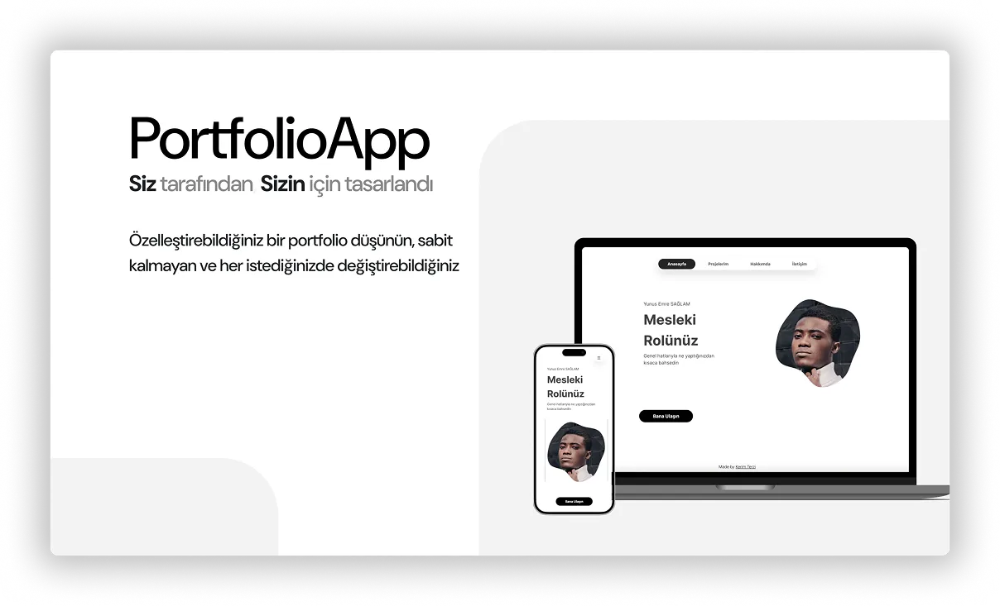
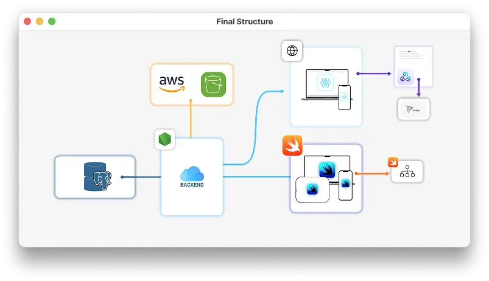
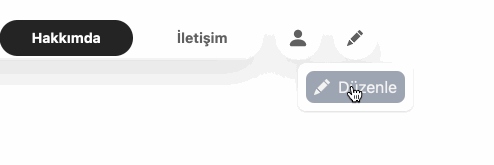
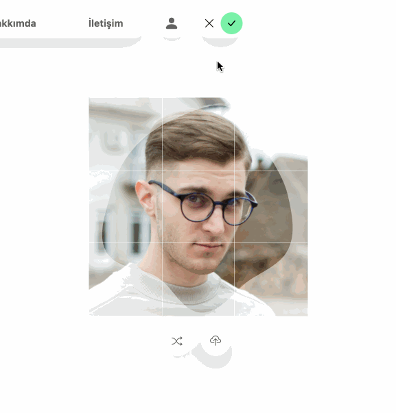
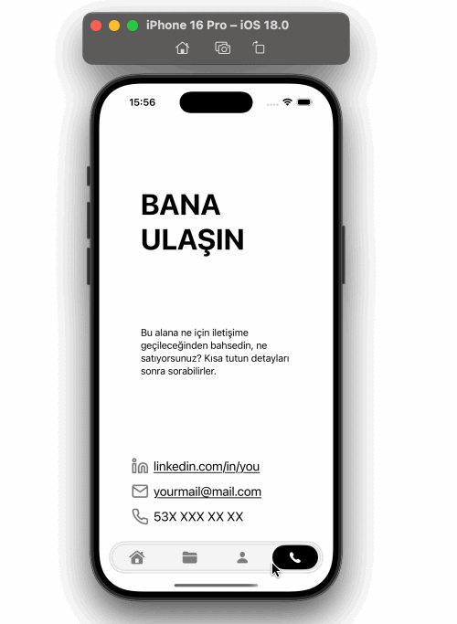
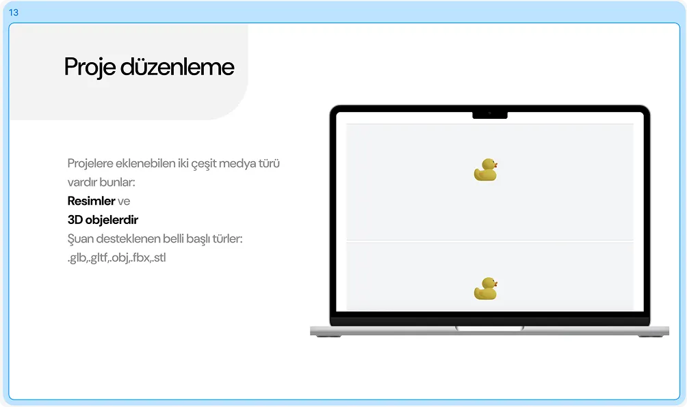

# Portfolio App

This repository contains a customizable portfolio application designed to give complete control to the site owner (admin) without the need for third-party intervention.

The project is structured as a full-stack application with modern technologies and a focus on user-friendly content management.

---

## Overview

The goal of this project is to create a portfolio application that:

- Does **not** rely on hard-coded static content.
- Allows the **admin** to edit and update the site at any time.
- Supports **rich content customization** (text, images, videos, and even 3D models).
- Delivers a smooth and professional **user experience**.

---

## Project Structure

The project consists of three main parts:

1. **Backend**

   - **Node.js** server
   - **PostgreSQL** database
   - **JWT-based authentication**

2. **Frontend**

   - Built with **React** and **Vite**
   - Rich customization tools (WYSIWYG editor with [React BlockNote])
   - Skeleton loaders and image placeholders for a smooth UI

3. **Mobile Application (iOS & macOS)**
   - Implemented in **SwiftUI** for training purposes
   - Mirrors the web app functionality
   - Includes reusable components and custom text editor logic

## Architecture

---

## Features

### Admin Control

- Edit and manage content at any time without touching source code.
- Add and update projects, images, videos, and documents.

### WYSIWYG Text Editor

- Built using **React BlockNote**.
- Provides **what-you-see-is-what-you-get** editing experience.
- Enables admins to create blog-like pages similar to Notion/Medium.

### Advanced Image Handling

- **AWS S3** storage for images and 3D models.
- Sophisticated **profile image editing**: crop, zoom, and blob-shaped masks (SVG).

### Smooth User Experience

- **Low-res placeholders** displayed before high-res images finish loading. Achieving lazy image loadign and ensuring smooth user experiecne.

### 3D Model Support

- Upload and display 3D files in portfolio projects.
- Especially useful for engineers or designers showcasing 3D work.

### Mobile App

- Native **SwiftUI** implementation.
- Provides a simplified version of the portfolio site.
- Replicates customization logic where possible.

---
